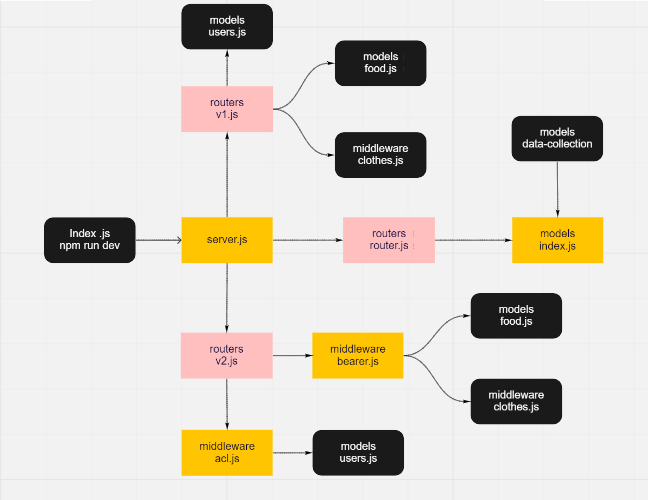

# auth-api
## Author:
- Essam Omar

## Setup :
- .env /PORT=3000

## Test :
- npm run test

## Running the app:
- npm run dev

## Deployment Test :
- Heroku : https://essam-auth-api.herokuapp.com/
- Backend: https://github.com/essamomar93/auth-api
- last Pull request: https://github.com/essamomar93/auth-api/pull/2 

## Languages :
- javascript

## UML :

